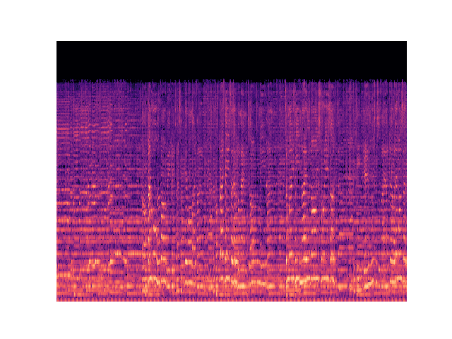
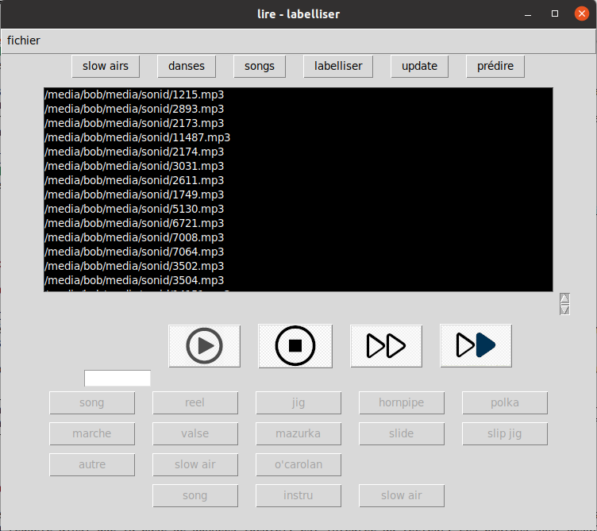

# classifieur audio : airs de danse / chanson / airs lents 

Mon but était de classifier une base de données musicale d'environ 30000 mp3 en musique traditionnelle irlandaise en la séparant en 3. Les chansons - a capella ou non, les 'slow airs et les airs de danse : jigs, reels, hornpipes etc. 

Une api est alors mise en place afin d'obtenir une liste à écouter - ou à travailler quand on est musicien - de 50 airs de danses, au format playlist musicale.

La labellisation a été effectuée en partie avec les noms d'airs webscrapés sur le site https://thesession.org/, et une partie avec un lecteur audio (TKinter, PyGame) connecté à une base de données PostgreSql.  L'apprentissage a obtenur des résultats satisfaisants (environ 96% de bonnes classifications sur les airs de danse) avec des réseaux de neurones à convolutions.  

La classification se fait par spectrogramme (transformation de Mel), images correspondant à 30 secondes de musique. 

Le lecteur créé pour l'occasion :  

